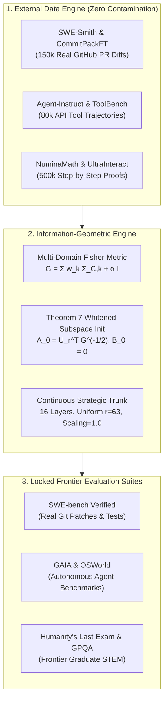

# 🌐 ResearchX 2.0: Frontier Multi-Domain Geodesic Adaptation Architecture

**Executive Research Director & Information Geometry Group**  
**Repository**: `srishanthsriramula/ReseachX`  
**Strategic Mandate**: Scale from few-shot micro-dose experiments to **Real-World Deep Software Engineering (SWE-bench)**, **Agentic Planning (GAIA / OSWorld)**, and **Frontier Scientific Reasoning (Humanity's Last Exam / GPQA)** using clean, uncontaminated external training datasets.

---

## 🏛️ 1. The Core Scientific Philosophy of ResearchX 2.0

```
                          ResearchX 2.0 Scientific Philosophy
                                           │
        ┌──────────────────────────────────┼──────────────────────────────────┐
        ▼                                  ▼                                  ▼
1. Real-World Task Complexity       2. Zero Contamination Protocol     3. Multi-Domain Geodesic Shield
• Multi-file codebase refactoring. • Training ONLY on external        • Information-geometric whitening
• Long-horizon agentic tool use.     real-world corpora.                protects multiple general
• Graduate-level scientific proofs.• Evaluation on locked benchmarks.   capabilities simultaneously.
```

---

## 🗺️ 2. The 3 Frontier Domains, External Corpora & Evaluation Suites

```
                             ResearchX 2.0 Frontier Domains
                                           │
       ┌───────────────────────────────────┼───────────────────────────────────┐
       ▼                                   ▼                                   ▼
Domain 1: Deep SWE                  Domain 2: Agentic Planning          Domain 3: Frontier Science
• Multi-file bug localization.      • Multi-step tool use / APIs.       • Graduate STEM / Physics / Math.
• Repository git patch generation.  • Environment state tracking.       • Symbolic proofs & multi-hop logic.
• Test-driven patch synthesis.      • OS & browser execution.           • Complex deductive synthesis.
```

---

### 💻 Domain 1: Real-World Deep Software Engineering (SWE)
* **The Task**: Given a real-world GitHub repository issue, localize the bug across hundreds of files, synthesize a clean unified Git patch (`diff`), and pass all reproduction unit tests without breaking regression suites.
* **External Training Corpora (No Benchmark Overlap)**:
  1. `SWE-Smith / CommitPackFT`: $150,000+$ real GitHub pull request diffs, commits, and issue discussions across Python, TypeScript, Rust, and Go.
  2. `CodeFeedback-Filtered`: Multi-turn conversational code debugging and AST transformation traces.
* **Evaluation Benchmark Suite (Locked Out-of-Distribution)**:
  * 🎯 **SWE-bench Lite** ($300$ instances) & **SWE-bench Verified** ($500$ human-validated instances).
  * 🎯 **SWE-bench Multilingual** (Python, Java, C++, JS).
* **Retained Control Capabilities (Invariance Protected)**:
  * Python standard library syntax, general programming idioms, docstring synthesis, and type annotation rules.

---

### 🤖 Domain 2: Agentic Multi-Step Planning & Autonomous Tool Use
* **The Task**: Multi-hop agentic reasoning where an autonomous agent executes terminal commands, queries APIs, parses JSON/HTML schemas, navigates browsers, and plans multi-step actions in dynamic environments.
* **External Training Corpora (No Benchmark Overlap)**:
  1. `Agent-Instruct / ToolBench-2.0`: $80,000+$ high-quality tool-use trajectories, API calling schemas, and error-recovery execution paths.
  2. `InterCode / Bash-Interactive`: Interactive terminal execution, file system management, and environment state recovery traces.
* **Evaluation Benchmark Suite (Locked Out-of-Distribution)**:
  * 🎯 **GAIA (General AI Assistants)** (Level 1, 2, and 3 multimodal web/file tasks).
  * 🎯 **OSWorld & WebArena** (Real operating system and web browser autonomous workflows).
  * 🎯 **AgentBench** (Multi-environment decision making).
* **Retained Control Capabilities (Invariance Protected)**:
  * Structured JSON schema compliance, factual conversational safety, markdown formatting, and API contract validity.

---

### 🔬 Domain 3: Frontier Scientific & Multi-Hop Reasoning (HLE / GPQA)
* **The Task**: Solving graduate-level physics, chemistry, biology, advanced mathematics, and multi-hop deductive puzzles requiring extensive chain-of-thought verification.
* **External Training Corpora (No Benchmark Overlap)**:
  1. `NuminaMath-CoT / Open-Web-Math`: $800,000+$ step-by-step mathematical proofs and Olympiad derivations.
  2. `UltraInteract / SciQ-Deep`: Multi-turn self-correction and scientific counterfactual reasoning.
* **Evaluation Benchmark Suite (Locked Out-of-Distribution)**:
  * 🎯 **Humanity's Last Exam (HLE)**: The gold-standard frontier reasoning benchmark.
  * 🎯 **GPQA Diamond** (Graduate-level Google-proof Q&A).
  * 🎯 **AIME 2024 / OlympiadBench**: National/international competition mathematics.
* **Retained Control Capabilities (Invariance Protected)**:
  * General world factual knowledge (MMLU-Pro), reading comprehension, and cross-disciplinary reasoning.

---

## 📐 3. Multi-Domain Information-Geometric Adaptation Formulation

When scaling to multi-domain foundation models, the model must maintain invariance across **multiple control domains simultaneously** ($\mathcal{D}_{C,1}, \mathcal{D}_{C,2}, \dots, \mathcal{D}_{C,K}$).

### 📌 The Generalized Multi-Domain Fisher Metric Tensor:
$$\mathbf{G_{\text{multi}}^{(l)}} = \sum_{k=1}^{K} w_k \cdot \Sigma_{C, k}^{(l)} + \alpha I$$

where $\Sigma_{C, k}^{(l)} = \mathbb{E}_{\mathcal{D}_{C,k}}[x x^T]$ is the activation covariance for retained capability $k$ (e.g., $k=1$ for syntax, $k=2$ for general facts, $k=3$ for API schemas).

### 📌 Generalized Theorem 7 Multi-Domain Subspace Initializer:
For target reasoning adaptation $\mathcal{D}_T$ (e.g., SWE patch synthesis or HLE proofs):

$$\mathbf{A_0^{(l)} = U_r^T \cdot \left( \sum_{k=1}^K w_k \Sigma_{C, k}^{(l)} + \alpha I \right)^{-1/2}} \quad \text{and} \quad \mathbf{B_0^{(l)} = 0}$$

* **Step-0 Exact Multi-Domain No-Op**: $\Delta h = 0$ on all retained capabilities.
* **Simultaneous Multi-Domain Shielding**: Gradients are orthogonalized against the union of all $K$ retained manifolds, preventing degradation of general conversation, syntax, or tool APIs during deep domain adaptation!

---

## 🛠️ 4. ResearchX 2.0 Implementation Architecture



---

## 📋 5. Strategic Deliverables for Next Phase:

1. **Modular Dataset Loaders**: Implement streaming data pipelines for external GitHub PR diffs (`SWE-Smith`), tool trajectories (`ToolBench`), and scientific derivations (`NuminaMath`).
2. **Multi-Domain Covariance Matrix Extractor**: Scalable GPU-accelerated covariance collector across multi-task prompt batches on the MI300X ($192\text{ GB}$ VRAM).
3. **SWE-bench / Agentic Execution Harness**: Local Dockerized execution sandbox for evaluating generated Git patches against reproduction test suites.
