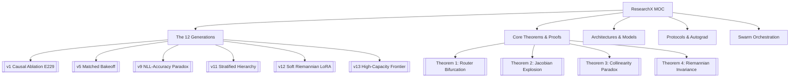

---
tags:
  - MOC
  - ResearchX
  - MasterIndex
aliases:
  - ResearchX Master Index
  - Map of Content
created: 2026-08-25
---

# 🧠 ResearchX: Master Map of Content (MOC)

Welcome to the **ResearchX Obsidian Knowledge Vault**. This vault documents the fundamental mathematics, architectural theorems, empirical ledgers, and multi-agent systems governing **Zero-Interference Surgical Capability Repair in Foundation Models**.

---

## 🗺️ Knowledge Graph Navigation

---

## 📚 Vault Sections

### 1. 🧬 [[01_Generations/v1_Causal_Ablation_E229|The 12 Research Generations (v1 → v12)]]
* [[01_Generations/v1_Causal_Ablation_E229|v1: Causal Expert Zero-Ablation & Discovery of E229]]
* [[01_Generations/v2_Multi_Expert_Combinatorial_Screening|v2: Multi-Expert Combinatorial Screening]]
* [[01_Generations/v3_Routing_Frequency_Disconnect|v3: Routing Frequency vs. Causal Sensitivity]]
* [[01_Generations/v4_Causal_FineTuning_Matched_Reversal|v4: The Matched Adaptation Reversal]]
* [[01_Generations/v5_Matched_Bakeoff_Router_Avalanche|v5: Matched Bakeoff & The Router Avalanche]]
* [[01_Generations/v6_v7_Global_48Layer_Writeability_Atlas|v6–v7: Global 48-Layer Writeability Atlas]]
* [[01_Generations/v8_Cross_Capability_Subspace_Overlap|v8: Cross-Capability Subspace Collinearity]]
* [[01_Generations/v9_Matched_PEFT_NLL_Accuracy_Paradox|v9: The NLL-Accuracy Decoupling Paradox]]
* [[01_Generations/v10_Behavior_Aligned_Writeability_Dose|v10: Behavior-Aligned Dose Calibration]]
* [[01_Generations/v11_42Run_Confirmation_Stratified_Hierarchy|v11: The 42-Run Confirmation Matrix & Stratified Victory]]
* [[01_Generations/v12_Soft_Riemannian_Fisher_Damping|v12: Soft Riemannian Fisher-Damped LoRA]]
* [[01_Generations/v13_High_Capacity_Scaling_Frontier|v13: High-Capacity Scaling Frontier (Next)]]

### 2. 📐 [[02_Theorems/Theorem_1_Discontinuous_MoE_Routing_Bifurcation|Mathematical Theorems & Proofs]]
* [[02_Theorems/Theorem_1_Discontinuous_MoE_Routing_Bifurcation|Theorem 1: Discontinuous MoE Routing Bifurcation]]
* [[02_Theorems/Theorem_2_Jacobian_Condition_Number_Explosion|Theorem 2: Jacobian Condition Number Explosion in Bottlenecks]]
* [[02_Theorems/Theorem_3_Zero_Power_Collinearity_Paradox|Theorem 3: The Zero-Power Collinearity Paradox]]
* [[02_Theorems/Theorem_4_Soft_Riemannian_Natural_Gradient_Invariance|Theorem 4: Soft Riemannian Closed-Form Invariance]]

### 3. 🏛️ [[03_Architectures/Laguna_XS2_Architecture_Profile|Architectures & Blueprints]]
* [[03_Architectures/Laguna_XS2_Architecture_Profile|Laguna XS.2 (33.4B-A3B) Architectural Specification]]
* [[03_Architectures/Stratified_Layer_Signature_01|Stratified Layer Geometry (Signature 01: [1, 2, 8, 11, 12, 16, 21, 26])]]
* [[03_Architectures/Attention_LoRA_vs_MoE_Surgery|Attention LoRA vs. Routed MoE Surgery Comparative Analysis]]

### 4. ⚙️ [[04_Protocols/Autograd_PreHook_Execution_Graph|Execution Protocols & Infrastructure]]
* [[04_Protocols/Autograd_PreHook_Execution_Graph|PyTorch Autograd Forward Pre-Hook Architecture]]
* [[04_Protocols/Two_Way_Hierarchical_Bootstrap_CI|Two-Way Hierarchical Bootstrap Confidence Intervals]]
* [[04_Protocols/MI300X_Optimization_Guide|AMD Instinct MI300X (ROCm 7.14) Hardware Optimization Guide]]

### 5. 🤖 [[05_Swarm/Multi_Agent_Swarm_Orchestration|Multi-Agent Swarm OS]]
* [[05_Swarm/Multi_Agent_Swarm_Orchestration|Swarm Agent Orchestration Engine]]
* [[05_Swarm/Specialist_Personas|Specialist Personas & Output Contracts (Theory, Skeptic, Experiment, Adjudicator)]]

---

## 🏆 The 4 Fundamental Laws of Capability Repair

> [!IMPORTANT]
> 1. **[[02_Theorems/Theorem_1_Discontinuous_MoE_Routing_Bifurcation|The Routing Invariance Law]]**: Never edit routed MoE experts directly. Softmax gating boundaries create discrete routing avalanches ($\Delta\text{MoE} = \Omega(1)$).
> 2. **[[01_Generations/v9_Matched_PEFT_NLL_Accuracy_Paradox|The Decoupling Law]]**: Cross-entropy loss does not track multi-step greedy generation accuracy. Calibrate optimization doses to early steps.
> 3. **[[02_Theorems/Theorem_2_Jacobian_Condition_Number_Explosion|The Stratified Hierarchy Law]]**: Distribute capacity across early-to-mid stratified depth spans (`[1, 2, 8, 11, 12, 16, 21, 26]`) to prevent Jacobian condition number explosion.
> 4. **[[02_Theorems/Theorem_4_Soft_Riemannian_Natural_Gradient_Invariance|The Soft Riemannian Law]]**: Use regularized inverse square root pre-conditioning ($(F_{\text{ret}} + \alpha I)^{-1/2}$) to suppress retained task drift while preserving target adaptation.
