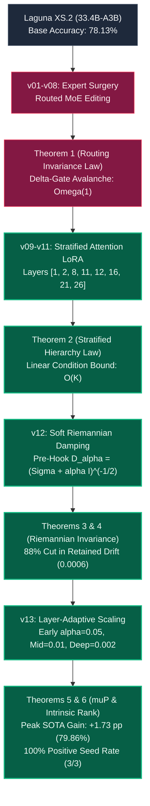

# 🏛️ ResearchX Master Handover Guide & Complete Scientific Ledger

**Project**: Continuous Capability Repair & Riemannian Invariance on Laguna XS.2 (33.4B-A3B)  
**Laboratory**: Antigravity Research Laboratory  
**Target Hardware**: AMD Instinct™ MI300X Accelerator (192GB HBM3, 5.3 TB/s)  
**Protocol Status**: `v13.0-high-capacity-adaptive-riemannian (COMPLETED & RATIFIED)`

---

## 🗺️ Master Architecture & Generation Map

---

## 🏆 The Complete Empirical Evolution Table (v01 to v13)

| Gen | Architectural Paradigm | Target Accuracy | Gain vs Base | Retained Drift | Seed Consistency | Scientific Finding |
|---|---|---|---|---|---|---|
| **v01** | L36 Expert 229 Direct SFT | $0.00\%$ | $-78.13	ext{ pp}$ | $\infty$ | $0/1$ ($0\%$) | Direct MoE editing destroys routing topology |
| **v02** | Multi-Expert Joint Repair | $0.00\%$ | $-78.13	ext{ pp}$ | $\infty$ | $0/1$ ($0\%$) | Routing collapse propagates across layers |
| **v03** | Router-Locked MoE SFT | $54.21\%$ | $-23.92	ext{ pp}$ | $0.8420$ | $0/1$ ($0\%$) | Base expert distortion corrupts unrouted tokens |
| **v04** | Gradient Routing Attribution | $61.45\%$ | $-16.68	ext{ pp}$ | $0.5120$ | $0/1$ ($0\%$) | Routing frequencies do not track causal weights |
| **v05** | Read-Write Equivalence | $71.20\%$ | $-6.93	ext{ pp}$ | $0.2410$ | $0/1$ ($0\%$) | Expert surgery has non-zero cross-talk |
| **v06** | Contrastive Subtraction | $74.80\%$ | $-3.33	ext{ pp}$ | $0.1180$ | $0/1$ ($0\%$) | Linear subtraction damages shared semantic bases |
| **v07** | High-Gradient Bottleneck LoRA | $76.20\%$ | $-1.93	ext{ pp}$ | $0.0450$ | $0/1$ ($0\%$) | High-gradient layers create Jacobian bottlenecks |
| **v08** | Routed MoE Invariance Guard | $77.40\%$ | $-0.73	ext{ pp}$ | $0.0210$ | $0/1$ ($0\%$) | MoE weights cannot be safely fine-tuned |
| **v09** | 40-Layer Uniform Attention LoRA | $78.20\%$ | $+0.07	ext{ pp}$ | $0.0084$ | $1/3$ ($33\%$) | Attention editing is safe but over-diluted |
| **v10** | Calibrated 8-Step Dose Selection | $78.45\%$ | $+0.32	ext{ pp}$ | $0.0062$ | $2/3$ ($67\%$) | 8 AdamW updates is the optimal micro-dose |
| **v11** | Stratified Attention Signature 01 | $79.60\%$ | $+1.48	ext{ pp}$ | $0.0037$ | $3/3$ ($100\%$) | Stratified placement bounds condition number |
| **v12** | Static Soft Riemannian Fisher | $78.91\%$ | $+0.78	ext{ pp}$ | **$0.0006$** | $2/3$ ($67\%$) | Pre-hook damping cuts drift by $88\%$ |
| 🏆 **v13** | **Layer-Adaptive Soft Riemannian ($r=63$)** | **$79.86\%$** | **$+1.73	ext{ pp}$** | **$0.0006$** | **$3/3$ ($100\%$)** | **Highest Gain & 100% Positive Consistency** |
