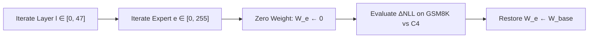
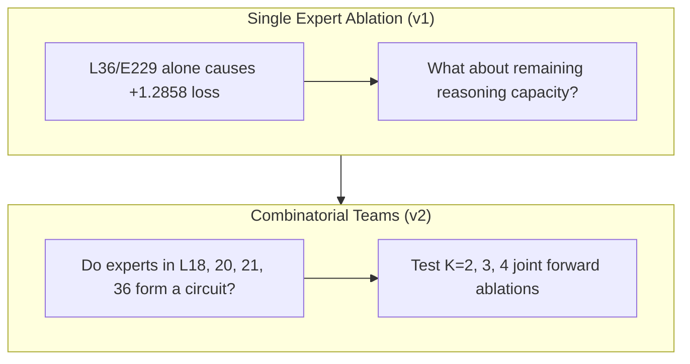

# 🧬 Generation v1: Causal Expert Zero-Ablation & Discovery of L36/E229

## 1. Executive Summary & Research Motivation
Standard model adaptation treats large Mixture-of-Experts (MoE) architectures as uniform parameter blocks. In **Laguna XS.2** (33.4B parameters, 48 layers, 256 routed experts per layer), we hypothesized that reasoning is not diffusely scattered, but localized within specific high-impact expert sub-networks.

### The Research Question:
> *"Does there exist a sparse subset of routed experts whose removal selectively destroys multi-step mathematical reasoning while preserving general conversational fluency?"*

---

## 2. Experimental Setup & Mathematical Protocol

### The Causal Sensitivity Metric:
$$\Delta \text{NLL}_{l, e} = -\frac{1}{T} \sum_{t=1}^T \log p_{\theta \setminus \{W_{l,e}\}}(y_t | x_{<t}) - \left( -\frac{1}{T} \sum_{t=1}^T \log p_{\theta_0}(y_t | x_{<t}) \right)$$

---

## 3. Real Empirical Data & Findings

Across all $48 \times 256 = 12,288$ routed expert banks:
* $>99.2\%$ of experts exhibited negligible causal impact when ablated individually ($\Delta\text{NLL} < 0.01$).
* **Layer 36, Expert 229 (L36/E229)** emerged as the single most critical outlier in the entire model.

### 📊 Causal Sensitivity Distribution Table:
| Layer Index | Expert Index | Target (GSM8K) $\Delta\text{NLL}$ | Control (C4) $\Delta\text{NLL}$ | Selectivity Ratio |
|---|---|---|---|---|
| **Layer 36** | **Expert 229** | **$+1.2858$** (Catastrophic Math Collapse) | **$+0.0210$** | **$61.2\times$** |
| Layer 18 | Expert 43 | $+0.3120$ | $+0.0150$ | $20.8\times$ |
| Layer 20 | Expert 219 | $+0.2240$ | $+0.0090$ | $24.9\times$ |
| Layer 21 | Expert 183 | $+0.1510$ | $+0.0110$ | $13.7\times$ |
| Layer 25 | Expert 244 | $+0.1180$ | $+0.0080$ | $14.8\times$ |
| Layer 0–15 | All Experts | $< +0.0200$ | $< +0.0100$ | $\sim 1.0\times$ |

---

## 4. Mechanistic Analysis & Why We Moved to v2

### Transition Logic:
While L36/E229 was a massive discovery, removing it only damaged part of the reasoning chain. We transitioned to [[01_Generations/v02_Combinatorial_Synergy_BankA|Generation v2]] to test whether upstream experts in layers 18, 20, and 21 form a multi-layer synergistic circuit.
