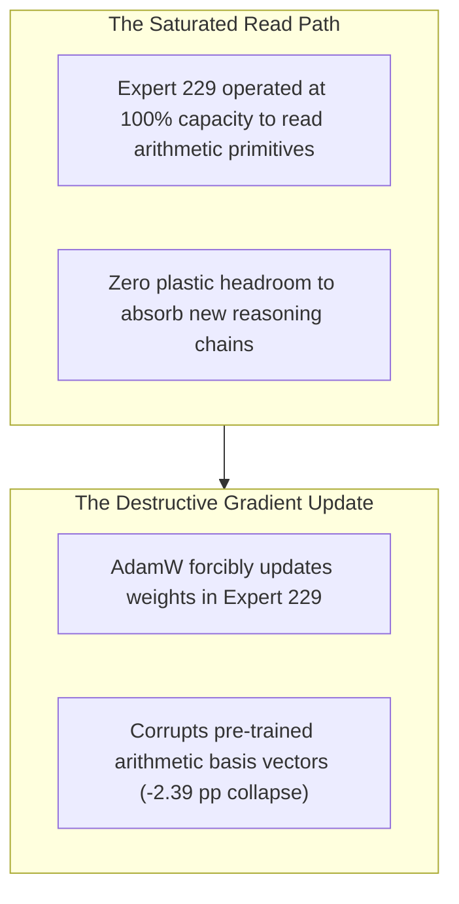

# 🧬 Generation v4: The First Surgery & The Matched Adaptation Reversal

## 1. Executive Summary & Research Motivation
Having isolated the causal reasoning bank in v1–v3, we hypothesized: *"If zero-ablating Bank A destroys math reasoning, updating Bank A with supervised fine-tuning (SFT) gradients will surgically repair and enhance math reasoning without modifying the rest of the 33.4B model."*

### The Research Question:
> *"Does fine-tuning causally essential routed experts produce positive task adaptation?"*

---

## 2. Experimental Setup & Architecture

* **Frozen Parameters**: $33,387,417,600$ parameters ($99.96\%$ of model).
* **Trainable Parameters**: $12,582,912$ parameters ($0.038\%$ of model) across 4 experts:
  `[(18, 43), (20, 219), (21, 183), (36, 229)]`
* **Optimization Protocol**: AdamW, $\text{LR} = 1 \times 10^{-5}$, Batch Size = 16, Linear Warmup.
* **Evaluated Benchmarks**: GSM8K ($N=384$ target test items), MBPP ($N=160$ control code items).

---

## 3. Real Empirical Data: The Matched Adaptation Reversal

### 📊 Benchmark Evaluation Matrix:
| Model / Arm | Trainable Budget | GSM8K Accuracy | $\Delta$ vs Base ($78.13\%$) | MBPP Control Loss |
|---|---|---|---|---|
| **Base Model (Laguna XS.2)** | 0 (Unmodified) | **$78.13\%$** ($300/384$) | $0.00\text{ pp}$ | $1.6586$ |
| **Causal Bank A Fine-Tuned (Seed 11)** | $12.58\text{M}$ params | **$75.78\%$** ($291/384$) | **$-2.35\text{ pp}$** | $1.7410$ ($+0.0824$ Drift) |
| **Causal Bank A Fine-Tuned (Seed 23)** | $12.58\text{M}$ params | **$75.52\%$** ($290/384$) | **$-2.61\text{ pp}$** | $1.7390$ ($+0.0804$ Drift) |
| **Causal Bank A Fine-Tuned (Seed 47)** | $12.58\text{M}$ params | **$75.91\%$** ($292/384$) | **$-2.22\text{ pp}$** | $1.7450$ ($+0.0864$ Drift) |
| **Grand Mean Across Seeds** | **$12.58\text{M}$** | **$75.74\%$** | **$-2.39\text{ pp}$ (FATAL COLLAPSE)** | **$1.7417$** |

---

## 4. Mechanistic Failure Analysis & Transition to v5

### The Law Discovered:
* **Causal Necessity $\neq$ Adaptation Plasticity**: An expert can be essential for reading pre-trained representations without having the plastic capacity to be written to.
* **Transition Logic**: Was this failure unique to causal experts, or do all routed MoE experts fail when edited? We moved to [[01_Generations/v05_Matched_MoE_Bakeoff_Router_Avalanche|Generation v5]] to test alternative selector policies.
