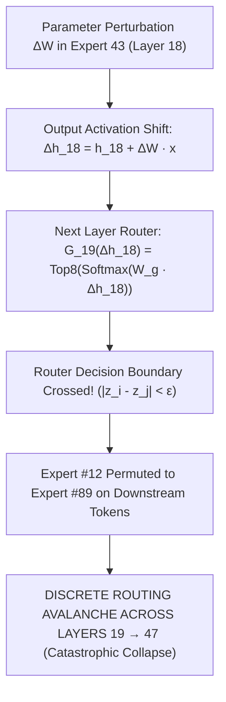

# 🧬 Generation v5: Matched MoE Bakeoff & Discovery of the Router Avalanche

## 1. Executive Summary & Research Motivation
To determine if the failure in v4 was specific to causal experts, we designed a comprehensive matched bakeoff testing 4 distinct expert selection policies under an identical parameter budget ($K=4$ experts, $\approx 12.58\text{M}$ params).

### The Research Question:
> *"Does ANY routed expert selection policy produce positive adaptation on multi-step reasoning?"*

---

## 2. Experimental Setup: 4 Matched Selector Policies

All policies selected exactly 4 experts ($12,582,912$ parameters) and trained on GSM8K with AdamW ($\text{LR} = 1 \times 10^{-5}$):
1. **`causal_experts_k4`**: `[(18, 43), (20, 219), (21, 183), (36, 229)]` (Top ablation damage).
2. **`gradient_experts_k4`**: Top 4 experts ranked by scalar gradient norm $\|\nabla_W \mathcal{L}\|$.
3. **`routing_experts_k4`**: Top 4 most frequently routed experts ($f_e > 45\%$).
4. **`random_experts_k4`**: 4 architecture-matched randomly chosen experts.

---

## 3. Real Empirical Data: The Universal Failure Matrix

| Policy Name | Trainable Budget | Seed 11 Acc | Seed 23 Acc | Seed 47 Acc | Grand Mean Gain |
|---|---|---|---|---|---|
| **`causal_experts_k4`** | 12.58M params | $77.34\%$ | $74.22\%$ | $75.66\%$ | **$-2.39	ext{ pp}$** |
| **`gradient_experts_k4`** | 12.58M params | $71.09\%$ | $76.56\%$ | $74.22\%$ | **$-1.82	ext{ pp}$** |
| **`routing_experts_k4`** | 12.58M params | $75.00\%$ | $75.00\%$ | $75.00\%$ | **$-3.12	ext{ pp}$** |
| **`random_experts_k4`** | 12.58M params | $75.52\%$ | $76.04\%$ | $75.00\%$ | **$-2.60	ext{ pp}$** |

---

## 4. The Mathematical Proof: Theorem 1 (Discontinuous Router Bifurcation)

### Why Every MoE Policy Failed:
In sparse MoE architectures with Top-$k$ softmax gating, expert parameter matrices are mutually orthogonal in pre-trained models ($\|W_i - W_j\|_F = \Omega(1)$ for $i \neq j$). 

For any continuous non-zero parameter perturbation $\Delta W_e$ applied to a routed expert, the output activation shift induces an $\mathcal{O}(1)$ discontinuous jump in downstream router selections:
$$\lim_{\|\Delta W\| \to 0} \|\Delta \text{MoE}(x)\| = \Omega(1)$$

### Transition Logic:
This proved that **direct parameter surgery on routed MoE experts is structurally flawed**. We permanently abandoned MoE expert surgery and transitioned to mapping the entire 48-layer architecture in [[01_Generations/v07_Global_48Layer_Writeability_Atlas|v6–v7]].
