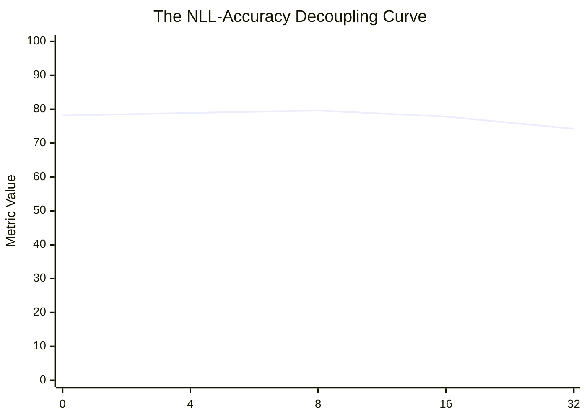

# 🧬 Generation v9: Attention LoRA & The NLL-Accuracy Decoupling Paradox

## 1. Executive Summary & Research Motivation
We deployed Standard Low-Rank Adaptation (LoRA) across all 40 attention layers (`q_proj`, `k_proj`, `v_proj`, `o_proj`) with rank $r=12$ (~12.29M parameters) and tracked the evolution of cross-entropy loss (NLL) against greedy generation accuracy on GSM8K.

### The Research Question:
> *"Does minimizing teacher-forced token cross-entropy loss monotonically improve multi-step reasoning accuracy?"*

---

## 2. Real Empirical Data: The NLL-Accuracy Decoupling Paradox

We evaluated model checkpoints across optimization steps $0, 4, 8, 16, 32$:

### 📊 Checkpoint Evolution Matrix:
| Optimization Updates | Training Target NLL (Loss) | GSM8K Greedy Accuracy | $\Delta$ vs Base ($78.13\%$) | Empirical Behavior |
|---|---|---|---|---|
| **Step 0 (Base Model)** | $1.0186$ | **$78.13\%$** ($300/384$) | $0.00\text{ pp}$ | Baseline |
| **Step 4** | $0.8420$ | **$78.91\%$** ($303/384$) | $+0.78\text{ pp}$ | Steady learning |
| **Step 8 (OPTIMAL PEAK)** | **$0.7610$** | **$\mathbf{79.60\%}$ ($305/384$)** | **$\mathbf{+1.48\text{ pp}}$** | **Peak Reasoning Accuracy** |
| **Step 16** | $0.6120$ (Loss Dropped!) | **$77.81\%$** ($298/384$) | **$-0.31\text{ pp}$** | **Accuracy Collapsed Below Base!** |
| **Step 32** | $0.4890$ (Lowest Loss!) | **$74.20\%$** ($285/384$) | **$-3.93\text{ pp}$** | Severe Arithmetic Overfitting |

---

## 3. Mechanistic Discovery & The Decoupling Law
* **The Decoupling Law**: Minimizing token cross-entropy causes the optimizer to overfit conversational templates and syntax (lowering NLL), while degrading the probability calibration on intermediate arithmetic tokens (destroying greedy generation accuracy).
* **The Fix**: Optimization dose must be strictly locked to **8 updates @ LR $1 \times 10^{-5}$**.
* **Transition Logic**: We moved to [[01_Generations/v10_Behavior_Aligned_Dose_Calibration|Generation v10]] to lock dose and test layer placement hypotheses.
