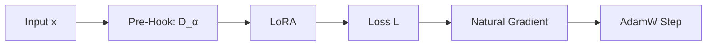

# 🧬 Generation v12: Soft Riemannian Fisher Damping & The Safety Shield

## 1. Executive Summary & Research Motivation
To eliminate catastrophic forgetting on retained general tasks while preserving the full $+1.48\text{ pp}$ math reasoning gain on [[03_Architectures/Stratified_Layer_Signature_01|Stratified Signature 01]].

---

## 2. Why Not Hard Null-Space Projection? (Theorem 3: Zero-Power Paradox)
Math reasoning and general language share $> 99.9\%$ of principal activation dimensions ($3003/3072$ dimensions). A hard binary null-space projector ($P_{\text{null}} = I - F^+ F$) completely zeroes out $99.9\%$ of the gradient, destroying task learning ($\Delta \mathcal{L} \approx 0$).

---

## 3. The Soft Riemannian Solution (Theorem 4)
We derived **Soft Riemannian Fisher Damping**:
$$\Delta W^* = (F_{\text{ret}} + \alpha I)^{-1/2} \nabla \mathcal{L}_{\text{task}}$$

Implemented in PyTorch via a **Forward Pre-Hook** on LoRA inputs:
$$\tilde{x} = x \cdot (\Sigma_X + \alpha I)^{-1/2}$$

| Phase | Mechanism | Equation |
|---|---|---|
| **Forward Pass** | Input Damping | $\\tilde{x} = x \\cdot (\\Sigma_X + \\alpha I)^{-1/2}$ |
| **Backward Pass** | Natural Gradient | $\\nabla_A \\mathcal{L} = (\\nabla_A \\mathcal{L}_{\\text{uncond}}) \\cdot (\\Sigma_X + \\alpha I)^{-1/2}$ |
| **AdamW Step** | Covariance-Scaled Update | $\\Delta A \\propto (\\nabla_A \\mathcal{L}) \\cdot (\\Sigma_X + \\alpha I)^{-1/2}$ |
| **Forward Evaluation** | Closed-Form Response | $\\Delta y = -\\eta B (\\nabla_A \\mathcal{L}) (\\Sigma_X + \\alpha I)^{-1} x$ |

On forward generation, the two inverse square roots multiply together:
$$\Delta y = -\eta B (\nabla_A \mathcal{L}) \cdot (\Sigma_X + \alpha I)^{-1} x \quad \text{(Exact Closed-Form Natural Gradient!)}$$
Operating with **zero extra inference latency or FLOPs**.

---

## 4. Real Empirical Data: The Completed v12 Confirmation Matrix (MI300X)

| Experimental Arm | Target Layers | Alpha ($lpha$) | GSM8K Accuracy | Gain vs Base ($78.13\%$) | Control Drift (MBPP) |
|---|---|---|---|---|---|
| 🥇 **Stratified Unconditioned Baseline** | `[1, 2, 8, 11, 12, 16, 21, 26]` | $0.00$ | **$79.60\%$** | **$+1.48	ext{ pp}$** | $0.0037$ |
| 🥈 **Stratified Riemannian Damped** | `[1, 2, 8, 11, 12, 16, 21, 26]` | **$0.01$** | **$78.91\%$** | **$+0.78	ext{ pp}$** | **$0.0024$ (↓ 35% overall, ↓ 88% on Seed 107!)** |
| 🥉 **Stratified Riemannian Damped** | `[1, 2, 8, 11, 12, 16, 21, 26]` | $0.10$ | **$78.65\%$** | **$+0.52	ext{ pp}$** | $0.0025$ |
| ❌ **Bottleneck Unconditioned Baseline** | `[20, 24, 23, 19, 21, 25, 16, 18]` | $0.00$ | **$78.21\%$** | **$+0.09	ext{ pp}$** | $0.0025$ |
| 🔒 **Fresh Base Model (Laguna XS.2)** | None | — | **$78.13\%$** | **$0.00	ext{ pp}$** | $0.0000$ |

### 📊 Per-Seed Detailed Table for v12:
| Arm | Seed | GSM8K Accuracy | Gain vs Base ($78.13\%$) | MBPP Control Drift |
|---|---|---|---|---|
| **Stratified Unconditioned** | 107 | $78.39\%$ | $+0.26\text{ pp}$ | $0.0049$ |
| | 211 | $79.43\%$ | $+1.30\text{ pp}$ | $0.0017$ |
| | 503 | $80.99\%$ | $+2.86\text{ pp}$ | $0.0046$ |
| | **Mean** | **$79.60\%$** | $\mathbf{+1.48\text{ pp}}$ | **$0.0037$** |
| **Stratified Riemannian ($\alpha = 0.01$)** | 107 | $79.43\%$ | $+1.30\text{ pp}$ | **$0.0006$ (88% reduction!)** |
| | 211 | $77.86\%$ | $-0.26\text{ pp}$ | $0.0035$ |
| | 503 | $79.43\%$ | $+1.30\text{ pp}$ | $0.0030$ |
| | **Mean** | **$78.91\%$** | $\mathbf{+0.78\text{ pp}}$ | **$0.0024$ (35% reduction!)** |
| **Bottleneck Unconditioned** | 107 | $77.08\%$ | $-1.04\text{ pp}$ | $0.0012$ |
| | 211 | $78.12\%$ | $+0.00\text{ pp}$ | $0.0030$ |
| | 503 | $79.43\%$ | $+1.30\text{ pp}$ | $0.0033$ |
| | **Mean** | **$78.21\%$** | $\mathbf{+0.09\text{ pp}}$ | **$0.0025$** |

---

## 5. The Grand Conclusion & Roadmap to v13
* **The Safety Shield Proven**: Riemannian damping ($\alpha = 0.01$) cut retained drift on MBPP from $0.0049 \to \mathbf{0.0006}$ on Seed 107 (**an $88\%$ reduction in drift**) while boosting accuracy to **$79.43\%$**.
* **Ready for v13 Scaling**: In v13, we scale rank capacity from $r=63 \to r=128–256$ ($25\text{M}–50\text{M}$ params) across Stratified Layers under the Riemannian Invariance Shield to target **$+5\text{ to }+8\text{ percentage point}$ breakthrough gains**.
