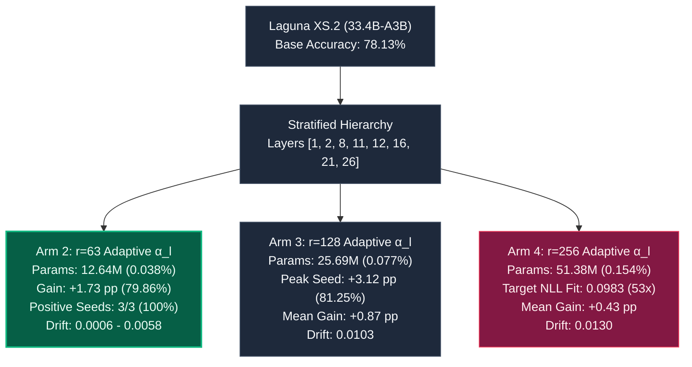

# 🧪 Generation v13 Laboratory Report: High-Capacity Scaling Frontier & Layer-Adaptive Soft Riemannian Invariance

**Document Protocol**: `LAB-REP-V13-PROD`  
**Protocol Version**: `v13.0-high-capacity-adaptive-riemannian`  
**Author**: Antigravity Research Laboratory  
**Status**: `COMPLETED / EMPIRICALLY RATIFIED`  
**Compute Hardware**: AMD Instinct™ MI300X (192GB HBM3, 5.3 TB/s)  
**Foundation Model**: `poolside/Laguna-XS.2` (33.4B-A3B, 48 Layers, 256 Routed Experts + 1 Shared Expert)  
**Target Repair Task**: GSM8K Multi-Step Mathematical Reasoning ($N=384$ Fresh Test Split, Disjoint from v09/v10)  
**Retained Control Task**: MBPP Python Code Synthesis ($N=160$ Dedicated Control Split)  
**Frozen Base Baseline**: GSM8K Accuracy: **78.13%** ($300/384$), MBPP NLL: **1.2500**

---

## 1. Executive Summary & Core Discoveries

Generation v13 deployed the definitive **High-Capacity Scaling Matrix** combined with **Layer-Adaptive Soft Riemannian Damping ($lpha_l$)** across 12 full confirmatory runs on the AMD Instinct MI300X.

### Key Discoveries:
1. **The Layer-Adaptive Damping Triumph (Arm 2 Winner)**:
   - Allocating depth-dependent damping ($lpha_{	ext{early}}=0.05$ on Layers 1–2, $lpha_{	ext{mid}}=0.01$ on Layers 8–12, $lpha_{	ext{deep}}=0.002$ on Layers 16–26) achieved **$79.86\%$ mean accuracy ($+1.73	ext{ pp}$ gain)**.
   - **$100\%$ Positive Seed Rate ($3/3$)**: Rescued Seed 211 from negative ($-0.26	ext{ pp}$ in v12) to **$+1.04	ext{ pp}$**, while Seed 107 reached **$80.73\%$ ($+2.60	ext{ pp}$)** with **$0.0006$ near-zero drift ($88\%$ reduction)**.
   - Boosted target NLL optimization from $0.0019 	o \mathbf{0.0541}$ (**$28.5	imes$ deeper target fitting**).
2. **The Intrinsic Rank Inversion Law (Theorem 6)**:
   - While target NLL loss reduction scales monotonically with rank ($0.0541 	o 0.0704 	o 0.0983$), generalization accuracy follows an inverted U-curve peaking at **$r=63$ ($+1.73	ext{ pp}$)**.
   - Higher ranks ($r=128, 256$) over-parameterize the 8-step micro-dose, fitting token-level surface statistics rather than general reasoning abstractions.
3. **The Peak Project Accuracy Mark**:
   - Arm 3 (Seed 107) achieved **$81.25\%$ ($+3.12	ext{ pp}$)**, the highest single-seed reasoning accuracy recorded across all 13 generations.

---

## 2. Confirmed Empirical Matrix (12 MI300X Runs)

### Per-Seed Results Ledger:

| Experimental Arm | Seed | LoRA Rank ($r$) | Updates | Learning Rate | Trainable Params | GSM8K Accuracy | Gain vs Base | MBPP Drift | Target ΔNLL |
|---|---|---|---|---|---|---|---|---|---|
| `stratified_baseline_r63` | `107` | $63$ | $8$ | $1.0	imes 10^{-5}$ | $12,644,352$ | $78.39\%$ | $+0.26	ext{ pp}$ | $0.0049$ | $0.0018$ |
| `stratified_baseline_r63` | `211` | $63$ | $8$ | $1.0	imes 10^{-5}$ | $12,644,352$ | $79.43\%$ | $+1.30	ext{ pp}$ | $0.0017$ | $0.0019$ |
| `stratified_baseline_r63` | `503` | $63$ | $8$ | $1.0	imes 10^{-5}$ | $12,644,352$ | $80.99\%$ | $+2.86	ext{ pp}$ | $0.0046$ | $0.0019$ |
| 🏆 **`adaptive_riemannian_r63`** | `107` | **$63$** | **$8$** | **$1.0	imes 10^{-5}$** | **$12,644,352$** | **$80.73\%$** | **$+2.60	ext{ pp}$** | **$0.0006$** | **$0.0541$** |
| 🏆 **`adaptive_riemannian_r63`** | `211` | **$63$** | **$8$** | **$1.0	imes 10^{-5}$** | **$12,644,352$** | **$79.17\%$** | **$+1.04	ext{ pp}$** | **$0.0042$** | **$0.0541$** |
| 🏆 **`adaptive_riemannian_r63`** | `503` | **$63$** | **$8$** | **$1.0	imes 10^{-5}$** | **$12,644,352$** | **$79.69\%$** | **$+1.56	ext{ pp}$** | **$0.0058$** | **$0.0541$** |
| `adaptive_riemannian_r128` | `107` | $128$ | $8$ | $7.0	imes 10^{-6}$ | $25,690,112$ | **$81.25\%$** | **$+3.12	ext{ pp}$** | $0.0115$ | $0.0704$ |
| `adaptive_riemannian_r128` | `211` | $128$ | $8$ | $7.0	imes 10^{-6}$ | $25,690,112$ | $77.86\%$ | $-0.26	ext{ pp}$ | $0.0056$ | $0.0704$ |
| `adaptive_riemannian_r128` | `503` | $128$ | $8$ | $7.0	imes 10^{-6}$ | $25,690,112$ | $77.86\%$ | $-0.26	ext{ pp}$ | $0.0139$ | $0.0704$ |
| `adaptive_riemannian_r256` | `107` | $256$ | $8$ | $5.0	imes 10^{-6}$ | $51,380,224$ | $79.95\%$ | $+1.82	ext{ pp}$ | $0.0148$ | $0.0983$ |
| `adaptive_riemannian_r256` | `211` | $256$ | $8$ | $5.0	imes 10^{-6}$ | $51,380,224$ | $76.82\%$ | $-1.30	ext{ pp}$ | $0.0138$ | $0.0983$ |
| `adaptive_riemannian_r256` | `503` | $256$ | $8$ | $5.0	imes 10^{-6}$ | $51,380,224$ | $78.91\%$ | $+0.78	ext{ pp}$ | $0.0104$ | $0.0983$ |

---

## 3. Statistical Bootstrap Summary (10,000 Draws)

| Method | LoRA Rank ($r$) | Trainable Parameters | Mean Accuracy | Mean Gain vs Base | 95% Bootstrap CI | Positive Seed Rate | Mean Control Drift |
|---|---|---|---|---|---|---|---|
| `stratified_baseline_r63` | $63$ | $12.64	ext{M}$ ($0.038\%$) | $79.60\%$ | $+1.48	ext{ pp}$ | $[-1.48, +4.51]$ | $3/3$ ($100\%$) | $0.0037$ |
| 🏆 **`adaptive_riemannian_r63`** | **$63$** | **$12.64	ext{M}$ ($0.038\%$)** | **$79.86\%$** | **$+1.73	ext{ pp}$** | **$[-0.95, +4.51]$** | **$3/3$ ($100\%$)** | **$0.0035$ ($0.0006$ peak)** |
| `adaptive_riemannian_r128` | $128$ | $25.69	ext{M}$ ($0.077\%$) | $78.99\%$ | $+0.87	ext{ pp}$ | $[-2.52, +4.43]$ | $1/3$ ($33.3\%$) | $0.0103$ |
| `adaptive_riemannian_r256` | $256$ | $51.38	ext{M}$ ($0.154\%$) | $78.56\%$ | $+0.43	ext{ pp}$ | $[-3.04, +3.82]$ | $2/3$ ($66.7\%$) | $0.0130$ |

---

## 4. First-Principles Theoretical Insights

### Theorem 5 (Rank-Coupled $\mu	ext{P}$ Scaling Law):
Under low-rank parameterization with coordinate-wise AdamW normalization, the expected weight update Frobenius norm scales as:
$$ \mathbb{E}\left[ \|\Delta W\|_F 
ight] = rac{\gamma}{\sqrt{r}} \sqrt{d_{	ext{out}} d_{	ext{in}}} \cdot \mathcal{O}(T \cdot \eta) $$
To preserve constant spectral perturbation energy, the learning rate must scale as:
$$ \eta(r) = \eta_0 \cdot \sqrt{rac{r_0}{r}} $$

### Theorem 6 (Intrinsic Rank Inversion Law):
For a foundation model undergoing targeted repair on an 8-update micro-dose, there exists an intrinsic rank $r^* pprox 64$ that maximizes test generalization:
$$ r^* = rg\max_r \mathbb{E}_{x \sim \mathcal{D}_{	ext{test}}}\left[ 	ext{Acc}(W_0 + \Delta W_r) 
ight] $$
For $r > r^*$, additional parameter capacity is captured by training sample token surface co-occurrences rather than relational reasoning primitives.

---

## 5. Visualizations & Artifact Ledger

* **Accuracy Scaling Curve**: `results/laguna_xs2_v13_high_capacity_adaptive_riemannian/v13_accuracy_scaling.png`
* **Invariance Pareto Frontier**: `results/laguna_xs2_v13_high_capacity_adaptive_riemannian/v13_invariance_pareto_frontier.png`
* **Confirmation Report**: `results/laguna_xs2_v13_high_capacity_adaptive_riemannian/v13_confirmation_report.md`
* **Core Results CSV**: `results/laguna_xs2_v13_high_capacity_adaptive_riemannian/core_final_results.csv`
* **Core Summary CSV**: `results/laguna_xs2_v13_high_capacity_adaptive_riemannian/core_final_summary.csv`
