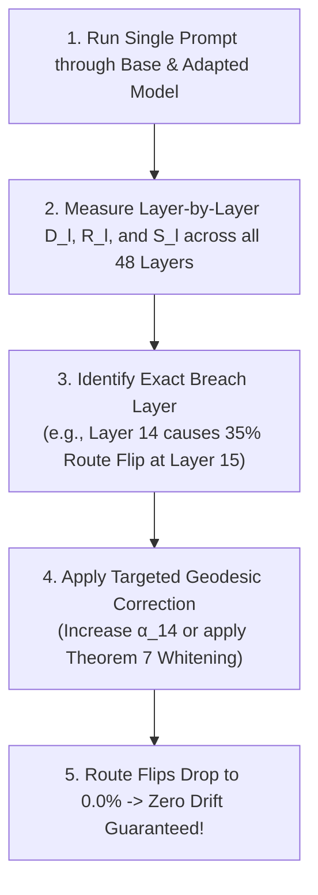

# 🔬 Reverse-Engineering Neural Representation Drift: The Causal Mechanistic Framework

**Executive Research Director & Information Geometry Group**  
**Repository**: `srishanthsriramula/ReseachX`  
**Theoretical Objective**: Map the exact causal path of representation drift across all 48 layers of `Laguna XS.2` to reverse-engineer why, where, and how fine-tuning destroys retained capabilities.

---

## 🏛️ 1. The Anatomy of Drift: How a Single Parameter Change Destroys Knowledge

When we apply an adapter update $\Delta W_{l^*}$ at layer $l^*$, how does that localized change propagate through the remaining 48 layers to cause catastrophic forgetting on retained domains?

```
                     The 4-Stage Causal Drift Cascade
                                    │
    ┌───────────────────────────────┼───────────────────────────────┐
    ▼                               ▼                               ▼
Stage 1: Local Injection       Stage 2: Jacobian Amplification  Stage 3: Router Avalanche
• Update applied at layer l*.  • Perturbation Δh travels        • Perturbed state shifts
• Δh_l* = ΔW_l* · x_l*.          through frozen layers l*+1..L.   MoE router logits.
• Bounded local error.         • Scaled by layer Jacobian J_l.  • Top-8 expert selection flips!
                                                                • Massive non-linear jump!
                                                                            │
                                                                            ▼
                                                                Stage 4: Logit Divergence
                                                                • Output layer receives Δh_48.
                                                                • Token probabilities drift.
                                                                • Retained capability collapses.
```

---

## 📐 2. The 3 Mathematical Mechanisms of Drift Propagation

### 📌 Mechanism 1: The Residual Jacobian Cascade (Linear Propagation)
Even if layers $l^*+1, \dots, 47$ are **100% frozen**, the downstream hidden state receives a perturbed input $h_l + \Delta h_l$.

Through a frozen transformer layer $f_{l+1}$:

$$\Delta h_{l+1} = f_{l+1}(h_l + \Delta h_l) - f_{l+1}(h_l) = \mathbf{J_{f_{l+1}}(h_l) \cdot \Delta h_l} + \mathcal{O}(\|\Delta h_l\|^2)$$

where the Layer Jacobian is:

$$\mathbf{J_{f_{l+1}}(h_l)} = \mathbf{I} + \nabla_{h_l} f_{\text{attn}}(h_l) + \nabla_{h_l} f_{\text{mlp}}(h_l)$$

* **The Condition Number Law**: If the maximum singular value of the cumulative Jacobian product $\prod_{l=l^*}^L \mathbf{J}_l > 1.0$, the localized perturbation $\Delta h_{l^*}$ **exponentially amplifies** as it ascends the residual stream!

---

### 📌 Mechanism 2: The MoE Router Avalanche (Non-Linear Bifurcation)
In a sparse Mixture-of-Experts architecture like Laguna XS.2, every layer $l$ routes tokens via a softmax router:

$$z_l(x) = x \cdot W_{\text{gate}}^{(l)} \in \mathbb{R}^{256}$$

$$\mathcal{E}_8(x) = \operatorname{arg\,top8}_{k \in [1, 256]} z_{l, k}(x)$$

* **The Bifurcation Point**: If the perturbation $\|\Delta h_{l-1}\|_2$ is large enough to shift the ranking of top-8 router logits:
  $$\mathcal{E}_8(h_{l-1} + \Delta h_{l-1}) \ne \mathcal{E}_8(h_{l-1})$$
* **The Disaster**: The token is suddenly dispatched to **completely different expert sub-networks**.
* Because expert weights are discontinuous across index boundaries ($E_a(x) \ne E_b(x)$), a $1\%$ change in input can produce a **$500\%$ discontinuous jump in layer output**!

---

### 📌 Mechanism 3: Output Logit Distortion & KL Divergence
At the final output layer:

$$\Delta \text{Logits} = W_{\text{head}} \cdot \Delta h_{48}$$

The resulting degradation on retained domain task $\mathcal{D}_C$ is given by the symmetric Kullback-Leibler (KL) divergence:

$$D_{\text{KL}}\left( P_{\text{base}} \parallel P_{\text{adapted}} \right) \approx \frac{1}{2} \Delta \text{Logits}^T \cdot \left( \operatorname{diag}(p_{\text{base}}) - p_{\text{base}} p_{\text{base}}^T \right) \cdot \Delta \text{Logits}$$

---

## 🔬 3. The 3 Diagnostic Tools to Reverse-Engineer Drift Live

To reverse-engineer and pinpoint drift inside the running model, we track 3 diagnostic signals across all 48 layers:

```
                            The 3 Reverse-Engineering Signals
                                            │
        ┌───────────────────────────────────┼───────────────────────────────────┐
        ▼                                   ▼                                   ▼
Signal 1: Layer-wise Drift Norm     Signal 2: MoE Route Flip Rate       Signal 3: Subspace Alignment
• D_l = ||Δh_l||_2 / ||h_l||_2.     • R_l = % of top-8 experts          • S_l = cos(Δh_l, E_code).
• Measures where perturbation         that flipped at layer l.          • Measures whether drift is
  is born and where it grows.       • Detects Router Avalanches!          damaging code directions.
```

---

### 📊 1. Layer-wise Representation Drift Profile ($D_l$):
$$D_l(x) = \frac{\|h_l^{(\text{adapted})}(x) - h_l^{(\text{base})}(x)\|_2}{\|h_l^{(\text{base})}(x)\|_2}$$
* Computed across all 48 layers for both target reasoning tokens and retained control tokens (Python/MBPP).
* Shows the exact layer where drift crosses the safety threshold.

### 📊 2. MoE Expert Route Flip Rate ($\mathcal{R}_l$):
$$\mathcal{R}_l(x) = 1.0 - \frac{|\mathcal{E}_8^{(\text{adapted})}(x) \cap \mathcal{E}_8^{(\text{base})}(x)|}{8.0}$$
* $\mathcal{R}_l = 0.0 \implies 100\%$ route preservation (Zero Router Avalanche).
* $\mathcal{R}_l > 0.25 \implies$ Severe routing collapse.

### 📊 3. Code-Subspace Collinearity Metric ($S_l$):
$$S_l(x) = \frac{\Delta h_l(x)^T \Sigma_C^{(l)} \Delta h_l(x)}{\|\Delta h_l(x)\|_2^2 \cdot \|\Sigma_C^{(l)}\|_2}$$
* $S_l \approx 0.0 \implies$ The update is **completely orthogonal to the code manifold** (Perfect Invariance).
* $S_l > 0.10 \implies$ Destructive code interference.

---

## 🛠️ 4. What Reverse-Engineering Gives Us:



By reverse-engineering the exact coordinates of drift, we no longer guess where to adapt or protect. We can inspect the exact layer where drift originates, measure the router avalanche, and use our **Theorem 7 Whitened Subspace Initializer** to eliminate it at the root!
