# 🏛️ Attention Sublayer LoRA vs. Routed MoE Surgery

## 1. Structural Comparison: Continuous Subspaces vs. Discrete Gating

```mermaid
flowchart TD
    subgraph AttentionSurgery ["Attention Sublayer LoRA (Continuous Subspace Surgery)"]
        A1["Activation x"] --> A2["LoRA Edit: Δy = B · (A · x)"]
        A2 --> A3["Continuous Shift: ||Δy|| ≤ ||B|| ||A|| ||x||"]
        A3 --> A4["Zero Router Bifurcations (Smooth Adaptation)"]
    end

    subgraph MoESurgery ["Routed MoE Expert Surgery (Discontinuous Discrete Surgery)"]
        M1["Activation x"] --> M2["Expert Edit: ΔE_e = ΔW · x"]
        M2 --> M3["Downstream Router: G_(l+1)(x + Δh)"]
        M3 --> M4["Discrete Boundary Cross (|z_i - z_j| < ε)"]
        M4 --> M5["Discrete Permutation Avalanche: ||Δh|| = Ω(1)"]
    end
```

---

## 2. Invariant Property Comparison Ledger

| Property / Metric | Routed MoE Expert Surgery (v01–v05) | Attention Sublayer LoRA (v09–v12) | Mathematical Reason |
|---|---|---|---|
| **Perturbation Continuity** | ❌ **Discontinuous** ($\Omega(1)$ jumps) | **Continuous** ($\Delta h \propto \Delta W$) | MoE router uses discrete Top-8 argmax gating |
| **Downstream Stability** | ❌ Cascading routing avalanches | Stable residual propagation | Attention residual stream is strictly additive |
| **Optimization Plasticity** | ❌ Negative generalization ($-2.39\text{ pp}$) | Positive adaptation (**$+1.48\text{ pp}$**) | Causal MoE experts are saturated read paths |
| **Geometric Regularization** | ❌ Impossible (Gating non-differentiable) | **Soft Riemannian Pre-Conditioning** | Exact Fisher Natural Gradient via Pre-Hooks |
| **Retained Drift Suppression**| ❌ Severe forgetting ($>+0.08$ drift) | **Up to $88\%$ drift reduction** | Soft damping preserves shared principal dimensions |
