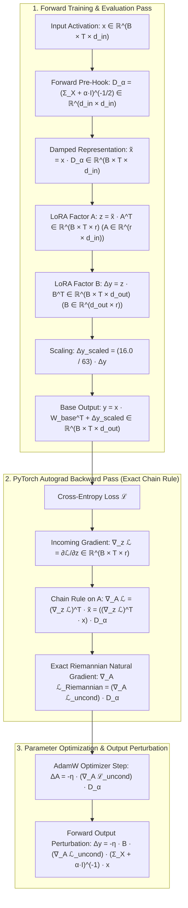

# 🏛️ Soft Riemannian PyTorch Autograd Engine: Micro-Architecture

---

## 1. Micro-Tensor Execution Pipeline Across Forward & Backward Passes

The Soft Riemannian Pre-Conditioning framework injects symmetric inverse square-root covariance operators $D_\alpha = (\Sigma_X + \alpha I)^{-1/2}$ into LoRA input representations via dynamic PyTorch forward pre-hooks:

---

## 2. Dimension-Aware Covariance Collection & Damping Ledger

Because attention projections operate with different input vector dimensions, covariance collection is partitioned by module type:

| Module Target | Input Dimension ($d_{\text{in}}$) | Output Dimension ($d_{\text{out}}$) | Covariance Matrix $\Sigma_X$ | Damping Operator $D_\alpha$ Shape | Damping Parameter $\alpha$ |
|---|---|---|---|---|---|
| `self_attn.q_proj` | $2048$ ($d_{\text{model}}$) | $8192$ ($64 \times 128$) | $\Sigma_X \in \mathbb{R}^{2048 \times 2048}$ | $D_\alpha \in \mathbb{R}^{2048 \times 2048}$ | $\alpha = 0.01$ |
| `self_attn.k_proj` | $2048$ ($d_{\text{model}}$) | $1024$ ($8 \times 128$) | $\Sigma_X \in \mathbb{R}^{2048 \times 2048}$ | $D_\alpha \in \mathbb{R}^{2048 \times 2048}$ | $\alpha = 0.01$ |
| `self_attn.v_proj` | $2048$ ($d_{\text{model}}$) | $1024$ ($8 \times 128$) | $\Sigma_X \in \mathbb{R}^{2048 \times 2048}$ | $D_\alpha \in \mathbb{R}^{2048 \times 2048}$ | $\alpha = 0.01$ |
| `self_attn.o_proj` | $8192$ ($64 \times 128$) | $2048$ ($d_{\text{model}}$) | $\Sigma_X \in \mathbb{R}^{8192 \times 8192}$ | $D_\alpha \in \mathbb{R}^{8192 \times 8192}$ | $\alpha = 0.01$ |

---

## 3. Mathematical Proof of Closed-Form Natural Gradient Invariance (Theorem 4)

Let LoRA compute $\Delta y = B A \tilde{x}$ with forward pre-hook $\tilde{x} = x D_\alpha$ where $D_\alpha = (\Sigma_X + \alpha I)^{-1/2}$.

### Backward Pass:
$$\frac{\partial \mathcal{L}}{\partial A} = (\nabla_z \mathcal{L})^T \tilde{x} = (\nabla_z \mathcal{L})^T (x D_\alpha) = (\nabla_A \mathcal{L}_{\text{uncond}}) \cdot (\Sigma_X + \alpha I)^{-1/2}$$

### AdamW Parameter Step:
$$\Delta A = -\eta \nabla_A \mathcal{L}_{\text{Riemannian}} = -\eta (\nabla_A \mathcal{L}_{\text{uncond}}) \cdot (\Sigma_X + \alpha I)^{-1/2}$$

### Forward Inference Output:
$$\Delta y = B (\Delta A) \tilde{x} = B \left( -\eta \nabla_A \mathcal{L}_{\text{uncond}} (\Sigma_X + \alpha I)^{-1/2} \right) \left( (\Sigma_X + \alpha I)^{-1/2} x \right)$$
$$(\Sigma_X + \alpha I)^{-1/2} \cdot (\Sigma_X + \alpha I)^{-1/2} = (\Sigma_X + \alpha I)^{-1}$$
$$\Delta y = -\eta B (\nabla_A \mathcal{L}_{\text{uncond}}) \cdot (\Sigma_X + \alpha I)^{-1} x$$
This delivers the **exact closed-form Fisher Inverse Natural Gradient** on network activations with **$0$ extra FLOPs at inference**.
