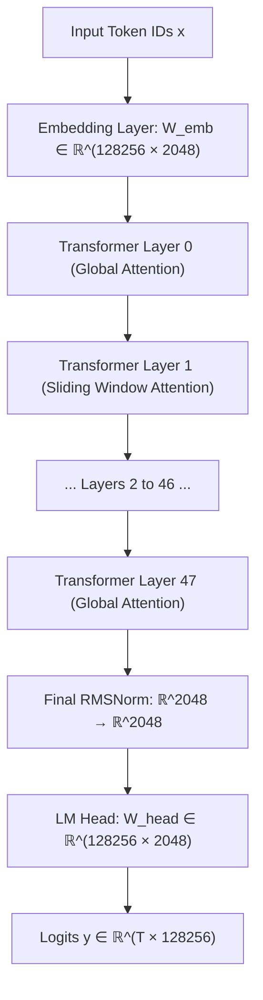
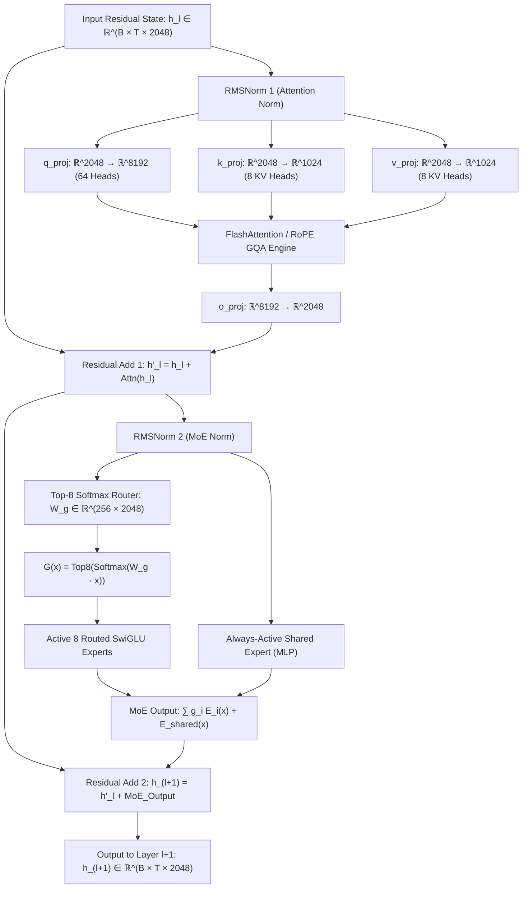

# 🏛️ Laguna XS.2 (33.4B-A3B) Full Architecture Blueprint

## 1. Macro Architecture & Layer Hierarchy

Laguna XS.2 is a 33.4-Billion parameter Sparse Mixture-of-Experts (MoE) foundation model operating with 3.0-Billion active parameters per forward token.

---

## 2. Micro-Architecture: Detailed Layer Block Structure

Each of the 48 transformer layers consists of an **Attention Sublayer (Grouped-Query Attention)** followed by a **Sparse MoE Sublayer (256 Routed Experts + 1 Shared Expert)**:

---

## 3. Parameter Dimensions & Hardware Memory Ledger

| Architectural Component | PyTorch Tensor Name | Input Dimension ($d_{\text{in}}$) | Output Dimension ($d_{\text{out}}$) | Total Parameters Per Layer |
|---|---|---|---|---|
| **Query Projection** | `self_attn.q_proj.weight` | $2048$ ($d_{\text{model}}$) | $8192$ ($64 \times 128$) | $16,777,216$ |
| **Key Projection** | `self_attn.k_proj.weight` | $2048$ ($d_{\text{model}}$) | $1024$ ($8 \times 128$) | $2,097,152$ |
| **Value Projection** | `self_attn.v_proj.weight` | $2048$ ($d_{\text{model}}$) | $1024$ ($8 \times 128$) | $2,097,152$ |
| **Output Projection** | `self_attn.o_proj.weight` | $8192$ ($64 \times 128$) | $2048$ ($d_{\text{model}}$) | $16,777,216$ |
| **MoE Router Gate** | `block_sparse_moe.gate.weight` | $2048$ ($d_{\text{model}}$) | $256$ (Experts) | $524,288$ |
| **256 Routed Experts** | `block_sparse_moe.experts[e]` | $2048$ ($d_{\text{model}}$) | $8192$ ($d_{\text{ffn}}$) | $256 \times 50.33\text{M} = 12.88\text{B}$ (Full Model) |
| **Shared Expert** | `block_sparse_moe.shared_expert` | $2048$ ($d_{\text{model}}$) | $8192$ ($d_{\text{ffn}}$) | $50,331,648$ |
