# 🏛️ Laguna XS.2 (33.4B-A3B) Master Architectural & Tensor Specification

---

## 1. Global Macro-Topology: End-to-End Sequence Forward Pass

Laguna XS.2 is a 48-layer decoder-only sparse Mixture-of-Experts transformer. The end-to-end forward computation pipeline from discrete input token sequence $X_{\text{tokens}} = [t_1, t_2, \dots, t_T]$ to output vocabulary logits $Y \in \mathbb{R}^{T \times 128256}$ is defined as follows:

```mermaid
flowchart TD
    subgraph MacroPipeline ["Global Model Macro-Pipeline (48 Transformer Layers)"]
        IN["Input Token Sequence: X_tokens ∈ ℕ^(B × T)"] --> EMB["Token Embedding Layer: W_embed ∈ ℝ^(128256 × 2048)"]
        EMB --> H0["Initial Hidden States: h_0 ∈ ℝ^(B × T × 2048)"]
        
        H0 --> L0["Transformer Layer 0 (Global Full Attention)"]
        L0 --> L1["Transformer Layer 1 (Sliding Window Attention, Window = 512)"]
        L1 --> L2["Transformer Layer 2 (Sliding Window Attention, Window = 512)"]
        L2 --> LDOT["... Alternating Sliding (36L) & Global (12L) Layers ..."]
        LDOT --> L47["Transformer Layer 47 (Global Full Attention)"]
        
        L47 --> FNORM["Final Layer RMSNorm (ε = 1e-6): ℝ^2048 → ℝ^2048"]
        FNORM --> HEAD["LM Output Head (Un-embedded): W_head ∈ ℝ^(128256 × 2048)"]
        HEAD --> LOGITS["Output Logits: Y ∈ ℝ^(B × T × 128256)"]
        LOGITS --> SOFTMAX["Softmax & Greedy Decoding / Sampling"]
    end
```

---

## 2. Micro-Architecture: Mathematical Deep-Dive into Transformer Layer $l$

Each of the 48 transformer layers executes two sequential residual sublayers:
1. **Grouped-Query Attention Sublayer (GQA)** with Rotary Position Embeddings (RoPE).
2. **Sparse SwiGLU Mixture-of-Experts Sublayer (MoE)** with Top-8 Softmax Routing and 1 Shared Expert.

```mermaid
flowchart TD
    subgraph LayerBlock ["Transformer Layer Block l ∈ [0, 47]"]
        IN_H["Input Residual State: h_l ∈ ℝ^(B × T × 2048)"] --> NORM1["RMSNorm 1: h̄_l = RMSNorm(h_l, ε=1e-6)"]
        
        subgraph Sublayer1 ["Sublayer 1: Grouped-Query Attention (GQA)"]
            NORM1 --> W_Q["W_Q Projection: ℝ^2048 → ℝ^8192 (64 Query Heads × 128)"]
            NORM1 --> W_K["W_K Projection: ℝ^2048 → ℝ^1024 (8 KV Heads × 128)"]
            NORM1 --> W_V["W_V Projection: ℝ^2048 → ℝ^1024 (8 KV Heads × 128)"]
            
            W_Q --> ROPE_Q["Apply RoPE Rotation: Q̃ = RoPE(Q, θ_base=500000)"]
            W_K --> ROPE_K["Apply RoPE Rotation: K̃ = RoPE(K, θ_base=500000)"]
            W_V --> V_TENSOR["Value Tensor: V ∈ ℝ^(B × 8 × T × 128)"]
            
            ROPE_Q & ROPE_K & V_TENSOR --> GQA_CORE["GQA Engine: Repeat KV Heads 8× (8 → 64 Heads)"]
            GQA_CORE --> SDPA["Scaled Dot-Product Attention: Attn = Softmax(Q̃ K̃^T / √128 + M_causal) · V"]
            SDPA --> W_O["W_O Projection: ℝ^8192 → ℝ^2048"]
        end

        IN_H --> RES1["First Residual Add: h'_l = h_l + W_O(Attn)"]
        W_O --> RES1
        
        RES1 --> NORM2["RMSNorm 2: h̄'_l = RMSNorm(h'_l, ε=1e-6)"]
        
        subgraph Sublayer2 ["Sublayer 2: Sparse Mixture-of-Experts (MoE)"]
            NORM2 --> ROUTER_GATE["Router Gate: W_g ∈ ℝ^(256 × 2048) → Logits z ∈ ℝ^(B × T × 256)"]
            ROUTER_GATE --> TOP8["Top-8 Selection: ℰ_8 = argtop8(z), Gating Coefficients g = Softmax(Top8(z))"]
            
            TOP8 --> EXP_BANK["Active 8 Routed SwiGLU Experts: E_i(h̄'_l) = W_down · (SiLU(W_gate · h̄'_l) ⊙ (W_up · h̄'_l))"]
            NORM2 --> SHARED_MLP["Always-Active Shared Expert: E_shared(h̄'_l)"]
            
            EXP_BANK & SHARED_MLP --> MOE_COMBINE["Weighted Sum: h_moe = ∑_(i=1)^8 g_i E_i(h̄'_l) + E_shared(h̄'_l)"]
        end

        RES1 --> RES2["Second Residual Add: h_(l+1) = h'_l + h_moe"]
        MOE_COMBINE --> RES2
        RES2 --> OUT_H["Output to Layer l+1: h_(l+1) ∈ ℝ^(B × T × 2048)"]
    end
```

---

## 3. Mathematical Formulation of Every Layer Operation

### 3.1 RMSNorm (Root Mean Square Normalization)
$$ar{h} = \frac{h}{\sqrt{\frac{1}{d} \sum_{i=1}^d h_i^2 + \epsilon}} \odot \gamma, \quad d = 2048, \quad \epsilon = 10^{-6}$$

### 3.2 Grouped-Query Attention (GQA) & RoPE
* **Query Transformation**: $Q = \bar{h}_l W_Q^T \in \mathbb{R}^{B \times T \times 8192}$ (64 heads, $d_{\text{head}} = 128$)
* **Key Transformation**: $K = \bar{h}_l W_K^T \in \mathbb{R}^{B \times T \times 1024}$ (8 heads, $d_{\text{head}} = 128$)
* **Value Transformation**: $V = \bar{h}_l W_V^T \in \mathbb{R}^{B \times T \times 1024}$ (8 heads, $d_{\text{head}} = 128$)
* **Rotary Position Embedding (RoPE)**:
  $$\tilde{Q}_{m, 2i:2i+2} = R_{\Theta, m} Q_{m, 2i:2i+2}, \quad R_{\Theta, m} = \begin{pmatrix} \cos(m \theta_i) & -\sin(m \theta_i) \\ \sin(m \theta_i) & \cos(m \theta_i) \end{pmatrix}, \quad \theta_i = 500000^{-2i/128}$$
* **GQA Head Replication**: $K$ and $V$ are broadcast across 8 query head groups:
  $$\operatorname{Attn}(Q, K, V) = \operatorname{Softmax}\left( \frac{\tilde{Q} \operatorname{repeat}_8(\tilde{K})^T}{\sqrt{128}} + M_{\text{causal}} \right) \operatorname{repeat}_8(V)$$
* **Output Linear Projection**: $h_{\text{attn}} = \operatorname{Attn}(Q, K, V) W_O^T \in \mathbb{R}^{B \times T \times 2048}$

### 3.3 Sparse Mixture-of-Experts (MoE) SwiGLU Gating
* **Router Softmax Logits**: $z = \bar{h}'_l W_g^T \in \mathbb{R}^{B \times T \times 256}$
* **Top-8 Gating Function**:
  $$g_i(x) = \begin{cases} \frac{\exp(z_i)}{\sum_{j \in \mathcal{E}_8} \exp(z_j)}, & i \in \mathcal{E}_8 = \operatorname{arg\,top8}_{k \in [1, 256]} z_k \\ 0, & i \notin \mathcal{E}_8 \end{cases}$$
* **SwiGLU Expert Activation**: Each routed expert $E_i$ and the shared expert compute:
  $$E_i(x) = \left( \operatorname{SiLU}(x W_{\text{gate}, i}^T) \odot (x W_{\text{up}, i}^T) \right) W_{\text{down}, i}^T$$
  where $W_{\text{gate}, i}, W_{\text{up}, i} \in \mathbb{R}^{8192 \times 2048}$, and $W_{\text{down}, i} \in \mathbb{R}^{2048 \times 8192}$.
* **Layer Output Combination**:
  $$h_{l+1} = h'_l + \sum_{i \in \mathcal{E}_8} g_i(h'_l) E_i(\bar{h}'_l) + E_{\text{shared}}(\bar{h}'_l)$$

---

## 4. Complete Tensor & Memory Ledger (AMD Instinct MI300X)

| Sublayer Component | PyTorch Tensor Name | Input Shape ($d_{\text{in}}$) | Output Shape ($d_{\text{out}}$) | Total Parameters / Layer | 48-Layer Model Footprint |
|---|---|---|---|---|---|
| **Query Projection** | `self_attn.q_proj.weight` | $2048$ ($d_{\text{model}}$) | $8192$ ($64 \times 128$) | $16,777,216$ | $805,306,368$ ($1.61\text{ GB}$) |
| **Key Projection** | `self_attn.k_proj.weight` | $2048$ ($d_{\text{model}}$) | $1024$ ($8 \times 128$) | $2,097,152$ | $100,663,296$ ($0.20\text{ GB}$) |
| **Value Projection** | `self_attn.v_proj.weight` | $2048$ ($d_{\text{model}}$) | $1024$ ($8 \times 128$) | $2,097,152$ | $100,663,296$ ($0.20\text{ GB}$) |
| **Output Projection** | `self_attn.o_proj.weight` | $8192$ ($64 \times 128$) | $2048$ ($d_{\text{model}}$) | $16,777,216$ | $805,306,368$ ($1.61\text{ GB}$) |
| **MoE Router Gate** | `block_sparse_moe.gate.weight` | $2048$ ($d_{\text{model}}$) | $256$ (Experts) | $524,288$ | $25,165,824$ ($0.05\text{ GB}$) |
| **256 Routed Experts** | `block_sparse_moe.experts[0..255]` | $2048$ ($d_{\text{model}}$) | $8192$ ($d_{\text{ffn}}$) | $256 \times 50.33\text{M} = 12.88\text{B}$ | $618,443,000,000$ ($61.84\text{ GB}$) |
| **Shared Expert** | `block_sparse_moe.shared_expert` | $2048$ ($d_{\text{model}}$) | $8192$ ($d_{\text{ffn}}$) | $50,331,648$ | $2,415,919,104$ ($4.83\text{ GB}$) |
| **Layer RMSNorms** | `input_layernorm`, `post_attention_layernorm` | $2048$ | $2048$ | $4,096$ | $196,608$ ($<1\text{ MB}$) |
| **Token Embeddings**| `model.embed_tokens.weight` | $128256$ (Vocab) | $2048$ ($d_{\text{model}}$) | — | $262,668,288$ ($0.53\text{ GB}$) |
| **LM Output Head** | `lm_head.weight` | $2048$ ($d_{\text{model}}$) | $128256$ (Vocab) | — | $262,668,288$ ($0.53\text{ GB}$) |
| **Grand Total** | **Laguna XS.2 Model Footprint** | — | — | **$695,838,720$ / Layer** | **$33,400,000,000$ ($66.8\text{ GB}$ in BF16)** |
