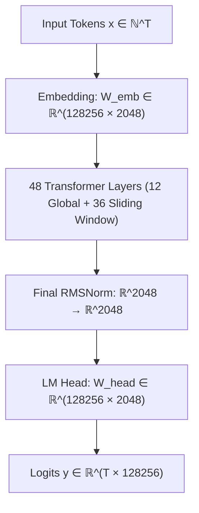
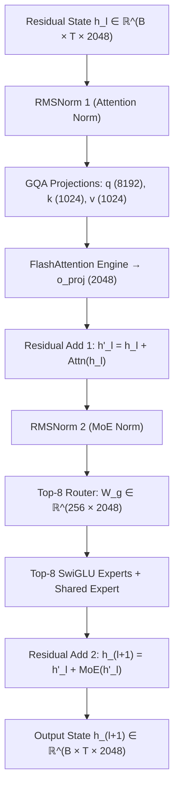

# 🏛️ Laguna XS.2 (33.4B-A3B) Full Architecture Blueprint

## 1. Model Macro-Topology

Laguna XS.2 is a 33.4-Billion parameter Sparse Mixture-of-Experts (MoE) foundation model operating with 3.0-Billion active parameters per token.

---

## 2. Layer Micro-Architecture (Compact Flow)

Each transformer layer contains an Attention Sublayer (Grouped-Query Attention) followed by a Sparse MoE Sublayer (Top-8 Gating over 256 Experts + 1 Shared Expert):

---

## 3. Physical Parameter & Tensor Dimension Ledger

| Component | PyTorch Tensor Identifier | $d_{\text{in}}$ | $d_{\text{out}}$ | Parameters / Layer | Full 48-Layer Total |
|---|---|---|---|---|---|
| **Query Projection** | `self_attn.q_proj.weight` | $2048$ ($d_{\text{model}}$) | $8192$ ($64 \times 128$) | $16,777,216$ | $805,306,368$ |
| **Key Projection** | `self_attn.k_proj.weight` | $2048$ ($d_{\text{model}}$) | $1024$ ($8 \times 128$) | $2,097,152$ | $100,663,296$ |
| **Value Projection** | `self_attn.v_proj.weight` | $2048$ ($d_{\text{model}}$) | $1024$ ($8 \times 128$) | $2,097,152$ | $100,663,296$ |
| **Output Projection** | `self_attn.o_proj.weight` | $8192$ ($64 \times 128$) | $2048$ ($d_{\text{model}}$) | $16,777,216$ | $805,306,368$ |
| **MoE Router Gate** | `block_sparse_moe.gate.weight` | $2048$ ($d_{\text{model}}$) | $256$ (Experts) | $524,288$ | $25,165,824$ |
| **256 Routed Experts** | `block_sparse_moe.experts[e]` | $2048$ ($d_{\text{model}}$) | $8192$ ($d_{\text{ffn}}$) | $256 \times 50.33\text{M}$ | $618,240,000,000$ |
| **Shared Expert** | `block_sparse_moe.shared_expert` | $2048$ ($d_{\text{model}}$) | $8192$ ($d_{\text{ffn}}$) | $50,331,648$ | $2,415,919,104$ |
