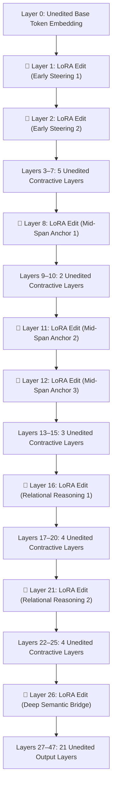

# 🏛️ Stratified Layer Geometry: Signature 01 Blueprint

## 1. Global 48-Layer Depth Map & Allocation Topology

In **Signature 01**, LoRA rank capacity ($r=63$) is distributed across **8 stratified early-to-mid depth spans**, separated by unedited contractive shock absorbers:

---

## 2. Comparative Functional Allocation Ledger

| Layer Depth Span | Receptive Field | Mathematical Structural Role | LoRA Rank ($r$) | Trainable Parameters |
|---|---|---|---|---|
| **Layer 1** | Sliding Window (512 tokens) | Early Input Representation Steering | $r=63$ | $1,580,544$ |
| **Layer 2** | Sliding Window (512 tokens) | Early Subspace Directional Alignment | $r=63$ | $1,580,544$ |
| **Layers 3–7** | Unedited (5 Layers) | **Contractive Shock Absorbers** ($\|J\| \le \rho < 1$) | $r=0$ | $0$ (Unmodified) |
| **Layer 8** | Sliding Window (512 tokens) | Early-to-Mid Relational Anchor | $r=63$ | $1,580,544$ |
| **Layers 9–10** | Unedited (2 Layers) | **Contractive Shock Absorbers** | $r=0$ | $0$ (Unmodified) |
| **Layer 11** | Sliding Window (512 tokens) | Mid-Span Feature Formulator | $r=63$ | $1,580,544$ |
| **Layer 12** | Global Attention (Full context) | Multi-Step Receptive Field Normalizer | $r=63$ | $1,580,544$ |
| **Layers 13–15** | Unedited (3 Layers) | **Contractive Shock Absorbers** | $r=0$ | $0$ (Unmodified) |
| **Layer 16** | Sliding Window (512 tokens) | Core Relational Operator 1 | $r=63$ | $1,580,544$ |
| **Layers 17–20** | Unedited (4 Layers) | **Contractive Shock Absorbers** | $r=0$ | $0$ (Unmodified) |
| **Layer 21** | Sliding Window (512 tokens) | Core Relational Operator 2 | $r=63$ | $1,580,544$ |
| **Layers 22–25** | Unedited (4 Layers) | **Contractive Shock Absorbers** | $r=0$ | $0$ (Unmodified) |
| **Layer 26** | Sliding Window (512 tokens) | Deep Semantic Bridge | $r=63$ | $1,580,544$ |
| **Layers 27–47** | Unedited (21 Layers) | **Unmodified Semantic Decoding Stream** | $r=0$ | $0$ (Unmodified) |
| **Total Allocation** | **8 Selected Layers** | **Stratified Depth Hierarchy** | **$r=63$** | **$12,644,352$ ($12.64\text{M}$)** |

---

## 3. Why Stratified Geometry Outperforms Bottlenecks (Theorem 2)
By separating edited layers with spans of 2 to 5 unedited layers, the contractive LayerNorm and attention operations absorb intermediate representation distortions, bounding the end-to-end condition number linearly:
$$\kappa(J_{\text{stratified}}) \le 1 + \sum_{k=1}^8 \sigma_{\max}(B_k A_k) \rho^{\Delta l_k} = \mathcal{O}(K)$$
yielding **$+1.48\text{ pp}$** gain vs. $+0.05\text{ pp}$ for contiguous bottlenecks.
