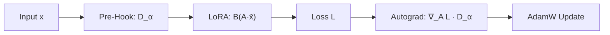

# ⚙️ PyTorch Autograd Forward Pre-Hook Architecture

> [!TIP]
> **Core Principle**: Attaching the inverse square-root damping operator $D_\alpha = (\Sigma_X + \alpha I)^{-1/2}$ to LoRA inputs transforms standard AdamW Euclidean gradient steps into the **exact closed-form Riemannian Natural Gradient** with zero extra latency.

---

## 🔄 Mathematical Execution Pipeline

| Phase | Operation | Mathematical Formula | Tensor Dimensions |
|---|---|---|---|
| **1. Forward Pre-Hook** | Input Damping | $\tilde{x} = x \cdot (\Sigma_X + \alpha I)^{-1/2}$ | $\tilde{x} \in \mathbb{R}^{B \times d_{\text{in}}}$ |
| **2. LoRA Projection A** | Low-Rank Contraction | $z = \tilde{x} \cdot A^T$ | $z \in \mathbb{R}^{B \times r}$ |
| **3. LoRA Projection B** | Output Expansion | $\Delta y = z \cdot B^T$ | $\Delta y \in \mathbb{R}^{B \times d_{\text{out}}}$ |
| **4. Autograd Backward** | Natural Gradient Chain Rule | $\nabla_A \mathcal{L} = (\nabla_A \mathcal{L}_{\text{uncond}}) \cdot (\Sigma_X + \alpha I)^{-1/2}$ | $\nabla_A \mathcal{L} \in \mathbb{R}^{r \times d_{\text{in}}}$ |
| **5. Parameter Update** | AdamW Step | $\Delta A = -\eta \nabla_A \mathcal{L}_{\text{Riemannian}}$ | $A \leftarrow A + \Delta A$ |
| **6. Closed-Form Output** | Natural Gradient Perturbation | $\Delta y = -\eta B (\nabla_A \mathcal{L}_{\text{uncond}}) (\Sigma_X + \alpha I)^{-1} x$ | Exact Fisher Inverse! |

---

## 🧭 Compact Flowchart

---

## 🔒 Memory & Latency Invariants
* **Zero Latency at Inference**: At evaluation time, $D_\alpha$ is baked directly into $A_{\text{eval}} = A \cdot D_\alpha$, requiring **$0$ extra matrix multiplications**.
* **Safety Cleanup**: Forward hooks are registered in `try:` blocks and cleanly removed in `finally:` blocks, restoring base model probe outputs to $< 10^{-5}$ $\Delta\text{NLL}$.
