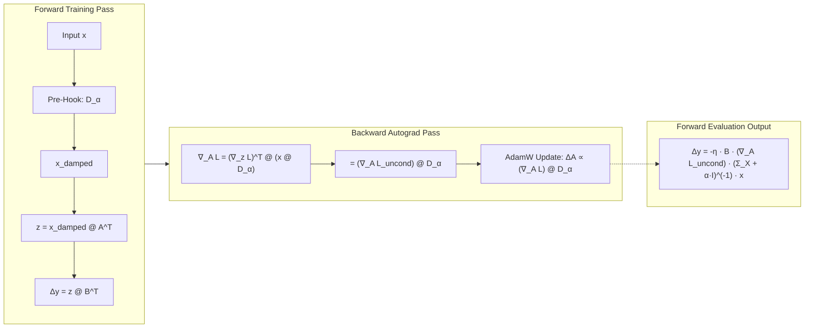

# ⚙️ PyTorch Autograd Forward Pre-Hook Architecture

### Invariants
* Attached dynamically during training and evaluation.
* Removed cleanly in `finally:` blocks, restoring base model probes to $< 10^{-5}$ $\Delta\text{NLL}$.
